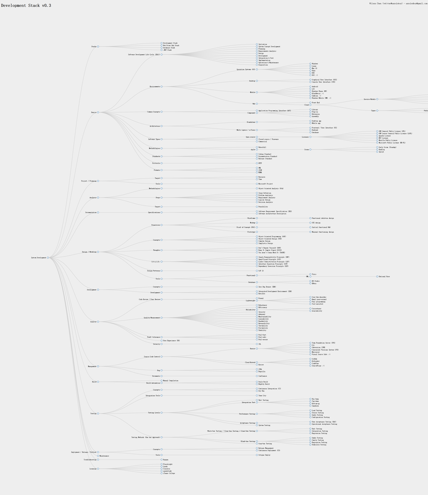

# Overflow Stack
The overflow stack family (System Development Stack, Web Front End Stack, Database Stack, .NET Stack etc.):
http://overflowstack.github.io

# DevelopmentStack
System development basics, analysis, project/planning, documentation, wireframe/mockup, design/modeling, implementation, quality, management, build, testing, deployment, maintenance, troubleshooting, learning

# What and why?
Have you ever wondered:
* what system development really includes? 
* how many do I possess?

I could not find a really comprehensive diagram that shows the system development stack, so I come up with my own version.

There might be issues here and there, like the category, the individual ones, but the beautity is you can modify it as you want.

You can have a graphical preview here (use mouse to move / zoom): 

https://rawgit.com/unruledboy/DevelopmentStack/master/ux/DevelopmentStack.htm 

# The Development Stack
<!--BUILD_START-->

- System Development
	- Stacks
		- [Development Stack](https://github.com/unruledboy/DevelopmentStack)
		- [Web Front End Stack](https://github.com/unruledboy/WebFrontEndStack)
		- [Database Stack](https://github.com/unruledboy/DatabaseStack)
		- [.NET Stack](https://github.com/unruledboy/DotNetStack)
	- Basics
		- [Software Development Life Cycle (SDLC)](https://en.wikipedia.org/wiki/Systems_development_life_cycle)
			- Initiation
			- System Concept Development
			- Planning
			- Requirements Analysis
			- Design
			- Development
			- Integration & Test
			- Implementation
			- Operations & Maintenance
			- Disposition
		- Environments
			- Operation Systems (OS)
				- Windows
				- Linux
				- Mac OS
				- Unix
				- BSD
				- DOS  ;-)
			- Desktop
				- Graphical User Interface (GUI)
				- Console User Interface (CUI)
			- Mobile
				- Android
				- iOS
				- Windows Phone (WP)
				- BlackBerry ;-)
				- Symbian ;-)
				- Windows Mobile (WM) ;-)
			- Web
				- Front End
				- Cloud
					- Service Models
						- System/Software as a Service (SaaS)
						- Platform as a Service (PaaS)
						- Infrastructure as a Service (IaaS)
						- Desktop as a Service (DaaS)
						- Backend as a Service (BaaS)
					- Types
						- Private Cloud
						- Public Cloud
							- Providers
								- Microsoft Azure
								- Amazon Web Services (AWS)
								- Google Cloud
						- Hybrid Cloud
			- Platforms
				- [.NET](https://github.com/unruledboy/DotNetStack)
				- [Java](https://www.java.com)
		- Common Concepts
			- Application Programming Interface (API)
			- Component
				- Library
				- Plug-in
				- Extension
				- Assembly
		- Architecture
			- Standalone
				- Desktop app
				- Mobile app
			- Multi Layers / n-Tiers
				- Frontend / User Interface (UI)
				- Backend
				- [Database](https://github.com/unruledboy/DatabaseStack)
		- Software Types
			- Open source
				- Licenses
					- GNU General Public License (GPL)
					- GNU Lesser General Public License (LGPL)
					- Apache License
					- MIT License
					- Mozilla Public License
					- Microsoft Public License (MS-PL)
			- Closed source / Freeware
			- Commercial
		- Methodologies
			- Waterfall
			- Agile
				- Scrum
					- Daily Scrum (Standup)
					- Backlog
					- Sprint
		- Standards
			- Coding Standard
			- Documentation Standard
			- Release Standard
		- Protocols
			- HTTP
		- Formats
			- XML
			- JSON
			- MIME
	- Project / Planning
		- Target
			- Resource
			- Time
		- Tools
			- Microsoft Project
	- Analysis
		- Methodologies
			- Object Oriented Analysis (OOA)
		- Steps
			- Scope Defintion
			- Problem Analsysis
			- Requirement Analysis
			- Logical Design
			- Decision Analysis
		- Target
			- Feasibility
	- Documentation
		- Specifications
			- Software Requirement Specification (SRS)
			- Software Architecture Description
	- Design / Modeling
		- Primitives
			- Wireframe
				- Functional skeleton design
			- Mockup
				- GUI design
			- Proof of Concept (POC)
				- Initial functional R&D
			- Prototype
				- Minimal functioning design
		- Concepts
			- Object Oriented Programming (OOP)
			- Object Oriented Design (OOD)
			- Complex Design
			- Simplistic Design
		- Thoughts
			- Don't Repeat Yourself (DRY)
			- Keep It Simple Stupid (KISS)
			- You Aren't Gonna Need It (YAGNI)
		- S.O.L.I.D.
			- Single Responsibility Principle (SRP)
			- Open/Closed Principle (OCP)
			- Liskov Subsistitution Principle (LSP)
			- Interface Segration Principle (ISP)
			- Dependency Inversion Principle (DIP)
		- Design Patterns
			- GoF 23
		- Tools
			- Functional
				- Visio
				- UML
					- Rational Rose
			- Database
				- ER Studio
				- ERwin
	- Development
		- Concepts
			- Zero Bug Bounce (ZBB)
			- [MVP (Minimum Viable Product)](https://en.wikipedia.org/wiki/Minimum_viable_product)
		- Development
			- Integrated Development Environment (IDE)
			- Retrofit
	- Quality
		- Code Review / Peer Review
			- Formal
			- Lightweight
				- Over-the-shoulder
				- Email pass-around
				- Pair programming
				- Tool-assisted
		- [Quality Measurement](https://en.wikipedia.org/wiki/Software_quality)
			- Robustness
			- Efficiency
			- Reliability
				- Correctness
				- Availability
			- Security
			- Adequacy
			- Maintainability
			- Learnability
			- Readability
			- Extensibility
			- Testability
			- Portability
			- Usability
		- Fault tolerance
			- [Fail-fast](https://en.wikipedia.org/wiki/Fail-fast)
			- Fail-safe
			- Fail-secure
		- User Experience (UX)
		- Security
			- SSL
			- Authentication
			- Authorization
	- Management
		- Source Code Control
			- Basics
				- Team Foundation Server (TFS)
				- Git
				- Subversion (SVN)
				- Concurrent Versions System (CVS)
				- Mercurial
				- Visual Source Safe ;-)
			- Cloud Hosted
				- GitHub
				- Bitbucket
				- CodePlex
				- SourceForge ;-)
			- Escrow
		- Bug
			- JIRA
			- Bugzilla
		- Documents
			- Confluence
	- Build
		- Manual Compilation
		- Build Automation
			- Daily Build
			- Nightly Build
	- Testing
		- Concepts
			- Continuous Integration (CI)
			- Dry Run
		- Integration Tools
			- Team City
		- Testing Levels
			- Unit Testing
			- Integration Test
				- Big bang
				- Top-down
				- Bottom-up
				- Sandwich
			- Performance Testing
				- Load Testing
				- Stress Testing
				- Spike Testing
				- Configuration Testing
			- Acceptance Testing
				- User Acceptance Testing (UAT)
				- Operational Acceptance Testing
			- System Testing
		- Testing Methods (the box approach)
			- White-box Testing / Clear-box Testing / Glass-box Testing
				- Unit Testing
				- Integration Testing
				- Regression Testing
			- Black-box Testing
				- Smoke Testing
				- Sanity Testing
				- Regression Testing
				- Usability Testing
			- Gray-box Testing
	- Deployment / Release / Rollout
		- Concepts
			- Release Management
			- Continuous Deployment (CD)
		- Tools
			- Octopus Deploy
	- Maintenance
	- Troubleshooting
		- [Raygun](https://raygun.io)
	- Learning
		- [Pluralsight](http://www.pluralsight.com/)
		- [Code School](https://www.codeschool.com/)
		- [Codecademy](https://www.codecademy.com/)
		- [Lynda](http://www.lynda.com/)
		- [Coursera](https://www.coursera.org/)
		- [open2study](https://www.open2study.com/)
		- iTunes College

<!--BUILD_END-->